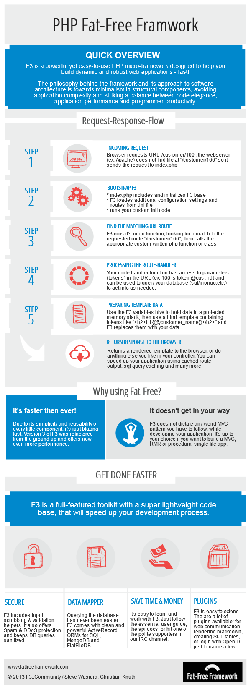

# Fat-Free Framework

### Спонсоры перевода

[Фабрика коробок ](https://ronbel.ru)[«](https://ronbel.ru)[РОНБЕЛ](https://ronbel.ru)[»](https://ronbel.ru)  
[Рекламное агенство OUTADV](http://outadv.pl)

### Создавайте Мощные Приложения

Воспользуйтесь преимуществами встроенных функций. Разрабатывайте приложения, которые действительно вдохновляют. F3 дает вам прочную основу, зрелую кодовую базу   
и простой подход к написанию веб-приложений.

### Пишите Меньше Кода

Ускорьте процесс разработки. F3-это легкий, простой в использовании и быстрый фреймворк. Но самое главное-он не стоит у вас на пути. Он имеет сглаженную кривую обучения, поэтому вы экономите время на обучение.

### Быстрый старт

[Оригинал документации](https://fatfreeframework.com)  
[Composer](https://packagist.org/packages/bcosca/fatfree)  
[GitHub](https://github.com/bcosca/fatfree) и лог [последний правок](https://github.com/bcosca/fatfree-core/blob/master/CHANGELOG.md)  
[F3 Google Group](https://groups.google.com/forum/#!forum/f3-framework) и [Slack](https://fatfreeframework-slack.herokuapp.com/)

Независимо от того, являетесь ли вы новичком или опытным программистом PHP,   
F3 поможет вам быстро начать работу. Никаких ненужных и кропотливых процедур установки. Никакой сложной конфигурации не требуется. Никаких запутанных структур каталогов.

Нет лучшего времени, чтобы начать разрабатывать веб-приложения простым способом,   
чем прямо сейчас!

[Скачать последний релиз](https://github.com/bcosca/fatfree/archive/master.zip)

### Rocket Science

Под капотом находится простой в использовании набор инструментов для веб-разработки, высокопроизводительная маршрутизация URL-адресов, многопротоколный механизм кэширования, встроенная подсветка кода и поддержка многоязычных приложений i18n.

F3 поддерживает базы данных SQL и NoSQL: MySQL, SQLite, MSSQL/Sybase, PostgreSQL, MongoDB и собственную молниеносную БД Flat-File \(мы называем ее Jig\). Он также поставляется с мощными объектно-реляционными картографами для абстракции данных   
и моделирования, которые так же легки, как и фреймворк. Никакой конфигурации   
не требуется.

F3 также может защитить вас от спама и DoS-атак, выполнив проверку DNSBL. Он может увеличить работоспособность вашего сервера и время безотказной работы, контролируя трафик веб-сервера с помощью анализа профиля и дроссельной заслонки пропускной способности.

Но это еще не все. F3 поставляется в комплекте с другими дополнительными плагинами, расширяющими его возможности:

Быстрый и чистый шаблонный движок   
Инструментарий модульного тестирования   
БД сессии   
Markdown-to-HTML конвертер   
Atom / RSS feed ридер  
Процессор обработки изображения   
Обработчик геоданных \(Geodata\)   
Компрессор Javascript / CSS   
OpenID   
Пользовательский логер   
Корзина / корзина для покупок   
Pingback сервер / клиент   
Строковые функции с поддержкой Unicode   
SMTP через SSL / TLS   
Инструменты для связи с другими серверами   
Валидация данных   
и еще [больше плагинов от F3-сообщества ](https://fatfreeframework.com/3.7/development#user-plugins)

В отличие от других фреймворков, F3 стремится быть пригодным для использования   
- а не обычным.

Философия, лежащая в основе фреймворка и его подхода к архитектуре программного обеспечения, заключается в минимализме структурных компонентов, избегании сложности приложений и достижении баланса между элегантностью кода, производительностью приложений и производительностью программиста.

